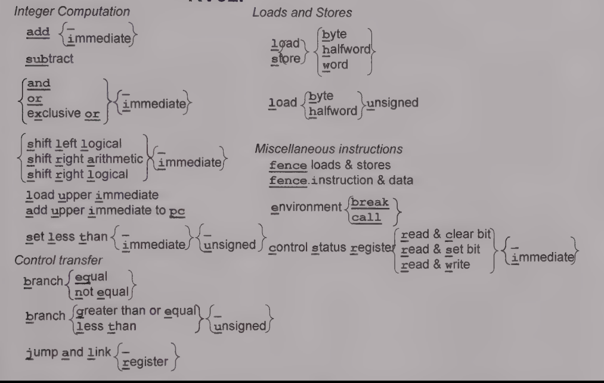

# RV32M instruction set

## Instruction set nomenclature
### RV32I

### M-extension

## R-type instructions
### General structure
|31      25|24     20|19     15|14   12|11     7|6      0|
|----------|---------|---------|-------|--------|--------|
|  func7   |   rs2   |   rs1   | func3 |   rd   | opcode |

### Instructions
| instruction |31      25|24     20|19     15|14   12|11     7|6       0|
|-------------|----------|---------|---------|-------|--------|---------|
|     add     |  0000000 |   rs2   |   rs1   |  000  |   rd   | 0110011 |
|     sub     |  0100000 |   rs2   |   rs1   |  000  |   rd   | 0110011 |
|     sll     |  0000000 |   rs2   |   rs1   |  001  |   rd   | 0110011 |
|     slt     |  0000000 |   rs2   |   rs1   |  010  |   rd   | 0110011 |
|     sltu    |  0000000 |   rs2   |   rs1   |  011  |   rd   | 0110011 |
|     xor     |  0000000 |   rs2   |   rs1   |  100  |   rd   | 0110011 |
|     srl     |  0000000 |   rs2   |   rs1   |  101  |   rd   | 0110011 |
|     sra     |  0100000 |   rs2   |   rs1   |  101  |   rd   | 0110011 |
|     or      |  0000000 |   rs2   |   rs1   |  110  |   rd   | 0110011 |
|     and     |  0000000 |   rs2   |   rs1   |  111  |   rd   | 0110011 |
|     mul     |  0000001 |   rs2   |   rs1   |  000  |   rd   | 0110011 |
|     mulh    |  0000001 |   rs2   |   rs1   |  001  |   rd   | 0110011 |
|     mulhsu  |  0000001 |   rs2   |   rs1   |  010  |   rd   | 0110011 |
|     mulhu   |  0000001 |   rs2   |   rs1   |  011  |   rd   | 0110011 |
|     div     |  0000001 |   rs2   |   rs1   |  100  |   rd   | 0110011 |
|     divu    |  0000001 |   rs2   |   rs1   |  101  |   rd   | 0110011 |
|     rem     |  0000001 |   rs2   |   rs1   |  110  |   rd   | 0110011 |
|     remu    |  0000001 |   rs2   |   rs1   |  111  |   rd   | 0110011 |

## I-type instructions
### General structure
|31                20|19     15|14   12|11     7|6      0|
|--------------------|---------|-------|--------|--------|
|      imm[11:0]     |   rs1   | func3 |   rd   | opcode |

### Instructions
| instruction |31                20|19     15|14   12|11     7|6       0|
|-------------|--------------------|---------|-------|--------|---------|
|    jalr     |      imm[11:0]     |   rs1   |  000  |   rd   | 1100111 |
|    lb       |      imm[11:0]     |   rs1   |  000  |   rd   | 0000011 |
|    lh       |      imm[11:0]     |   rs1   |  001  |   rd   | 0000011 |
|    lw       |      imm[11:0]     |   rs1   |  010  |   rd   | 0000011 |
|    lbu      |      imm[11:0]     |   rs1   |  100  |   rd   | 0000011 |
|    lhu      |      imm[11:0]     |   rs1   |  101  |   rd   | 0000011 |
|    addi     |      imm[11:0]     |   rs1   |  000  |   rd   | 0010011 |
|    slti     |      imm[11:0]     |   rs1   |  010  |   rd   | 0010011 |
|    sltiu    |      imm[11:0]     |   rs1   |  011  |   rd   | 0010011 |
|    xori     |      imm[11:0]     |   rs1   |  100  |   rd   | 0010011 |
|    ori      |      imm[11:0]     |   rs1   |  110  |   rd   | 0010011 |
|    andi     |      imm[11:0]     |   rs1   |  111  |   rd   | 0010011 |
|    slli     |  [0000000][shamt]  |   rs1   |  001  |   rd   | 0010011 |
|    srli     |  [0000000][shamt]  |   rs1   |  101  |   rd   | 0010011 |
|    srai     |  [0100000][shamt]  |   rs1   |  101  |   rd   | 0010011 |
|    fence    | [0000][pred][succ] |   rs1   |  000  |   rd   | 0001111 |

## S-type instructions
### General structure
|31      25|24     20|19     15|14     12|11     7|6      0|
|----------|---------|---------|---------|--------|--------|
|imm[11:5] |   rs2   |   rs1   |imm[4:0] |   rd   | opcode |

### Instructions
| instruction |31      25|24     20|19     15|14    12|11     7|6       0|
|-------------|----------|---------|---------|--------|--------|---------|
|     sb      | imm[11:5]|   rs2   |   rs1   |imm[4:0]|   rd   | 0100011 |
|     sh      | imm[11:5]|   rs2   |   rs1   |imm[4:0]|   rd   | 0100011 |
|     sw      | imm[11:5]|   rs2   |   rs1   |imm[4:0]|   rd   | 0100011 |

## B-type instructions
### General structure
|31              25|24     20|19     15|14     12|11             7|6      0|
|------------------|---------|---------|---------|----------------|--------|
|imm[12],imm[10:5] |   rs2   |   rs1   |  func3  |imm[4:1],imm[11]| opcode |

### Instructions
| instruction |31              25|24     20|19     15|14     12|11             7|6       0|
|-------------|------------------|---------|---------|---------|----------------|---------|
|    beq      |imm[12],imm[10:5] |   rs2   |   rs1   |   000   |imm[4:1],imm[11]| 1100011 |
|    bne      |imm[12],imm[10:5] |   rs2   |   rs1   |   001   |imm[4:1],imm[11]| 1100011 |
|    blt      |imm[12],imm[10:5] |   rs2   |   rs1   |   100   |imm[4:1],imm[11]| 1100011 |
|    bge      |imm[12],imm[10:5] |   rs2   |   rs1   |   101   |imm[4:1],imm[11]| 1100011 |
|    bltu     |imm[12],imm[10:5] |   rs2   |   rs1   |   110   |imm[4:1],imm[11]| 1100011 |
|    blgu     |imm[12],imm[10:5] |   rs2   |   rs1   |   111   |imm[4:1],imm[11]| 1100011 |

## U-type instructions
### General structure
|31                      12|11        7|6      0|
|--------------------------|-----------|--------|
|        imm[31:12]        |    rd     | opcode |

### Instructions
| instruction |31                      12|11        7|6       0|
|-------------|--------------------------|-----------|---------|
|     lui     |        imm[31:12]        |    rd     | 0110111 |
|    auipc    |        imm[31:12]        |    rd     | 0010111 |

## J-type instructions
### General structure
|31                                    12|11        7|6      0|
|----------------------------------------|-----------|--------|
|  imm[20],imm[10:1],imm[11],imm[19:12]  |    rd     | opcode |

### Instructions
| instruction |31                                    12|11        7|6       0|
|-------------|----------------------------------------|-----------|---------|
|     jal     |  imm[20],imm[10:1],imm[11],imm[19:12]  |    rd     | 1101111 |
